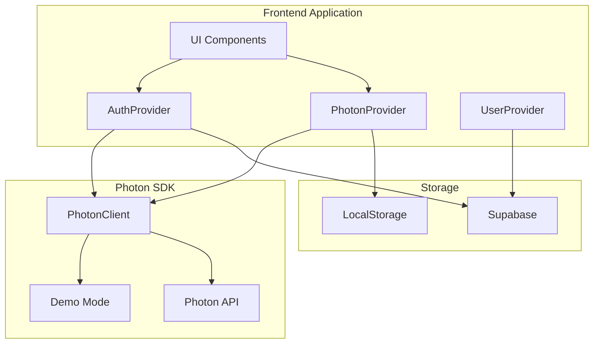
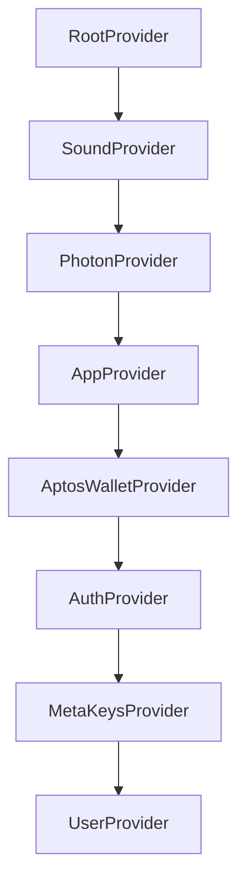
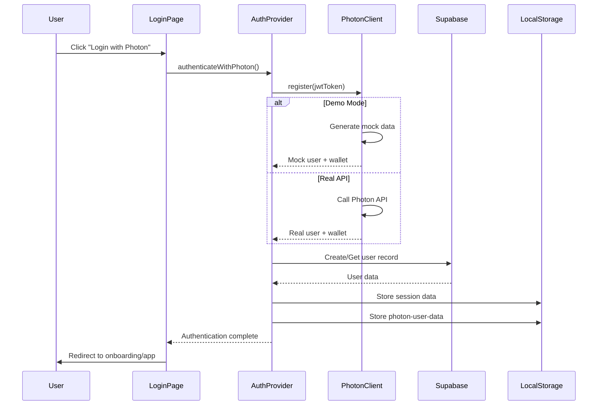
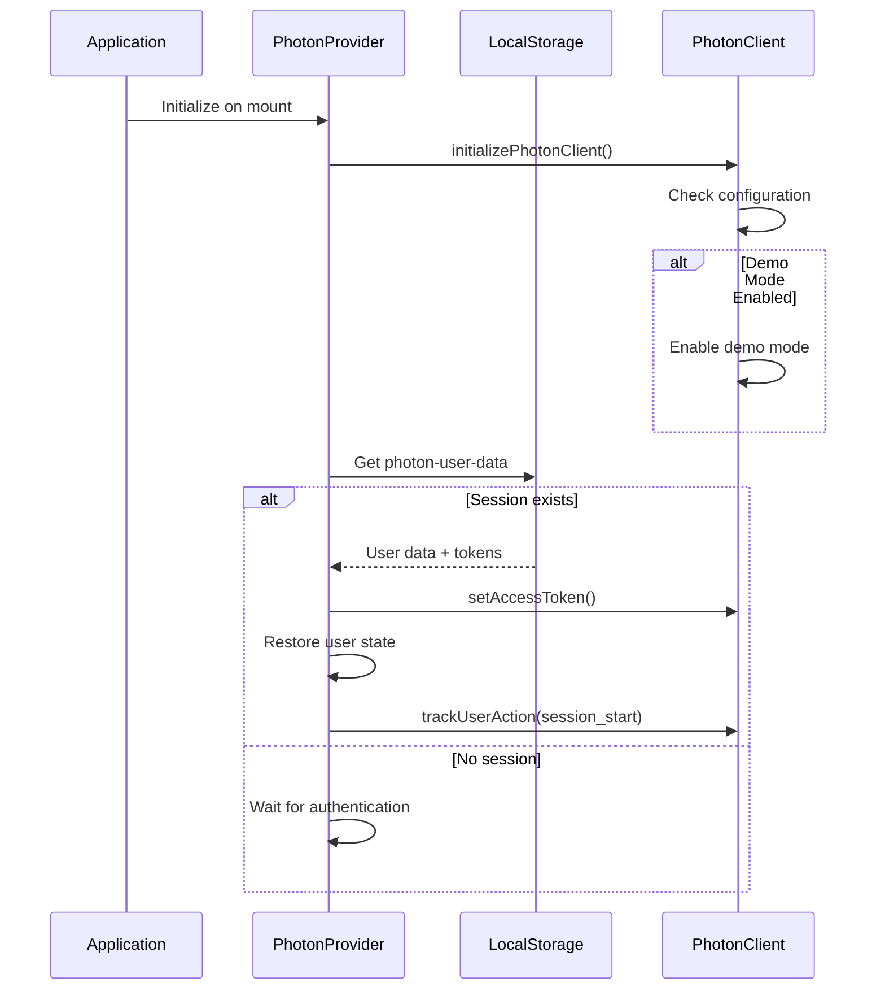
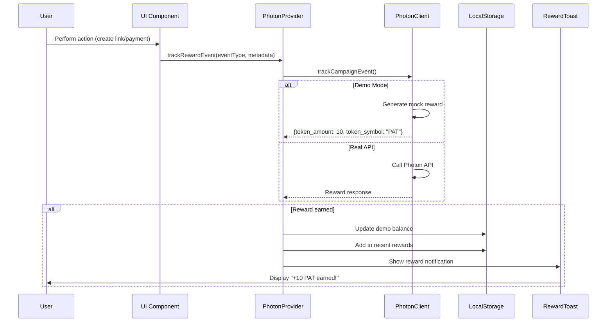
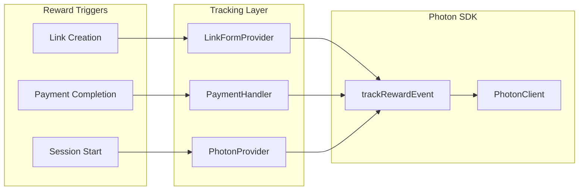
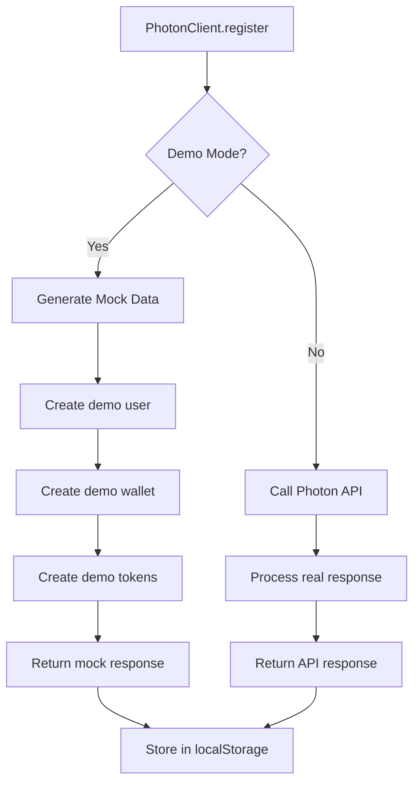
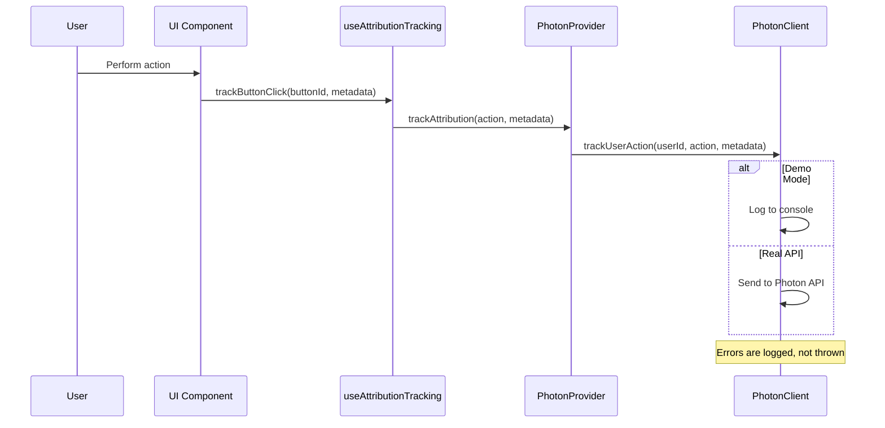
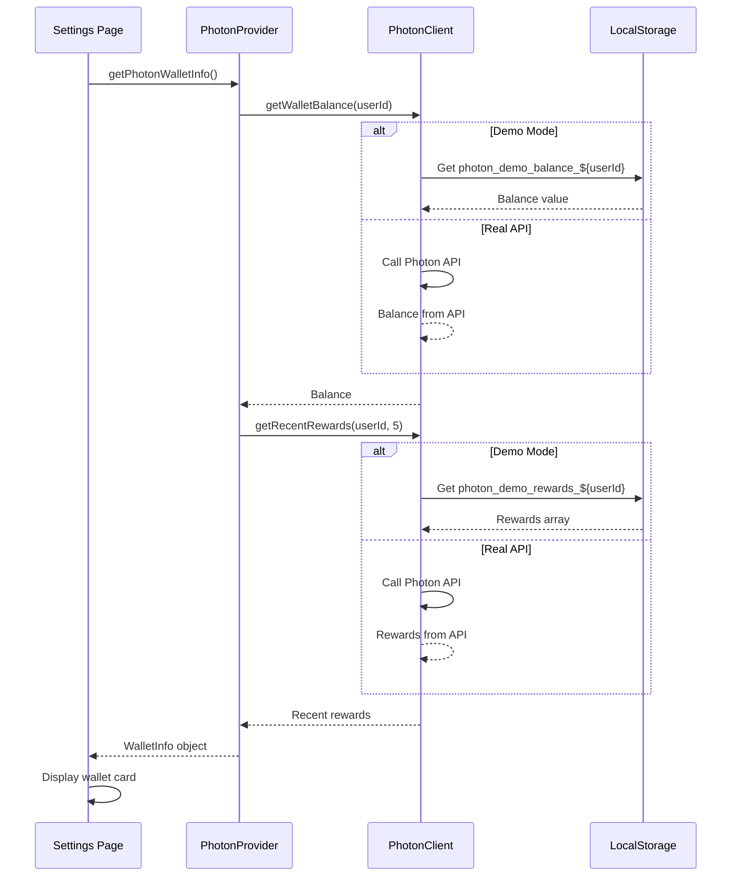
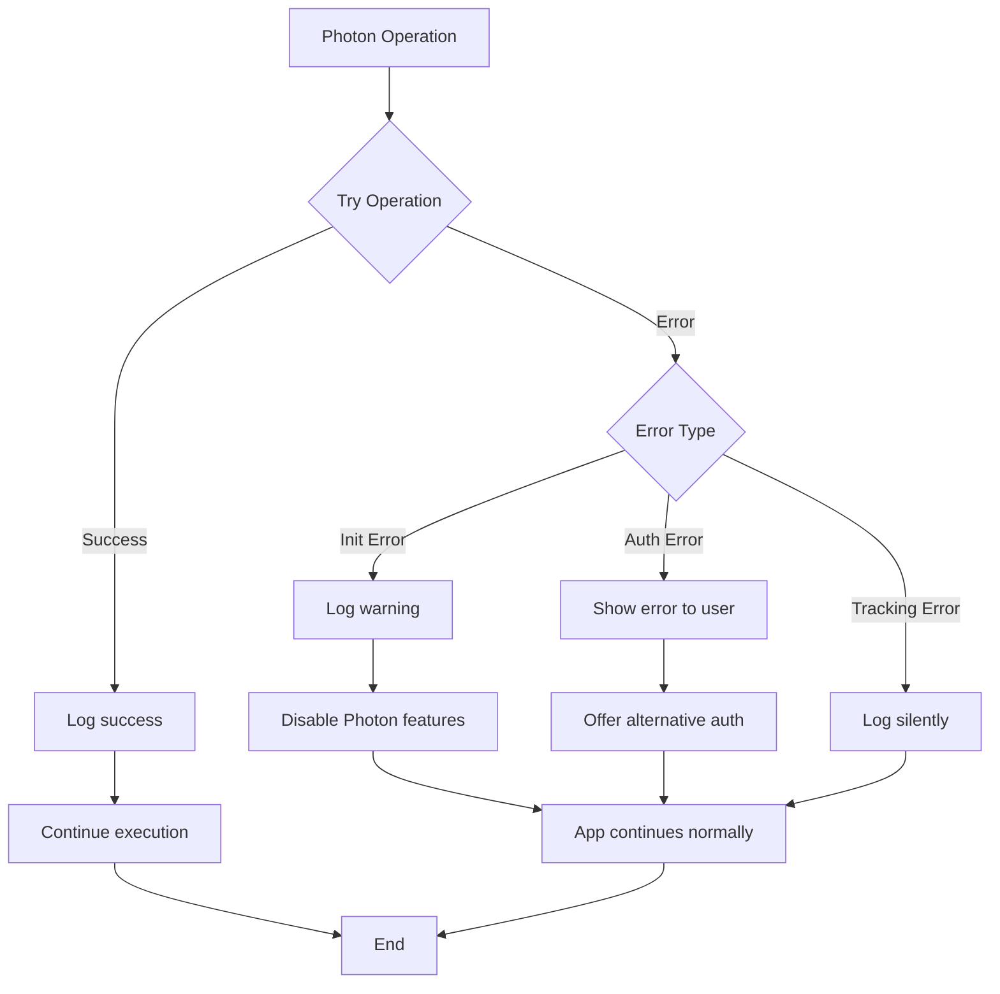

# Photon Integration Technical Documentation

## Overview

This document describes the Photon SDK integration in the Shingru payment application. Photon provides identity management, embedded wallets, and reward tracking functionality.

## Architecture

### System Components



### Provider Hierarchy



## Authentication Flow

### Photon Authentication



### Session Persistence



## Reward System

### Reward Tracking Flow



### Reward Amounts (Demo Mode)

| Event Type | PAT Amount |
|------------|------------|
| `link_created` | 10 |
| `payment_completed` | 25 |
| `session_start` | 5 |
| Other events | 1 |

### Integration Points



## Demo Mode

### Configuration

Demo mode activates when:
- `NEXT_PUBLIC_PHOTON_API_KEY` is not set, OR
- `NEXT_PUBLIC_PHOTON_BASE_URL` is not set, OR
- `NEXT_PUBLIC_PHOTON_DEMO_MODE=true`

### Demo Mode Behavior



### LocalStorage Structure (Demo Mode)

```typescript
// Balance
`photon_demo_balance_${userId}` → "125.50"

// Recent Rewards
`photon_demo_rewards_${userId}` → [
  {
    event_type: "link_created",
    timestamp: "2024-01-15T10:30:00Z",
    token_amount: 10,
    metadata: { linkId: "abc123" }
  }
]

// User Data
"photon-user-data" → {
  photonId: "demo_user_1234567890",
  walletAddress: "0xdemo1234abcd",
  createdAt: "2024-01-15T10:00:00Z",
  lastSeen: "2024-01-15T10:30:00Z",
  tokens: {
    access_token: "demo_access_token_...",
    refresh_token: "demo_refresh_token_...",
    token_type: "Bearer",
    expires_in: 3600,
    scope: "all"
  }
}
```

## Attribution Tracking

### Attribution Flow



### Attribution Events

| Event | Trigger | Metadata |
|-------|---------|----------|
| `page_view` | Page navigation | `{ page: "/app/links" }` |
| `button_click` | Button interaction | `{ buttonId: "create-link" }` |
| `feature_usage` | Feature interaction | `{ feature: "payment-link" }` |
| `session_start` | User login | `{ newUser: true/false }` |

## Wallet Display

### Wallet Info Fetch



## Error Handling

### Error Handling Strategy



### Error Categories

| Category | Behavior | User Impact |
|----------|----------|-------------|
| SDK Initialization | Log warning, disable features | None - app works normally |
| Authentication | Show error, offer alternatives | User can use Petra wallet |
| Reward Tracking | Log silently | None - action completes |
| Attribution | Log silently | None - action completes |
| Wallet Fetch | Return safe defaults | Shows zero balance |

## File Structure

```
src/
├── lib/photon/
│   ├── client.ts              # PhotonClient class
│   ├── types.ts               # TypeScript interfaces
│   ├── rewards.ts             # Reward tracking utilities
│   ├── attribution.ts         # Attribution utilities
│   └── README.md              # API documentation
├── providers/
│   ├── PhotonProvider.tsx     # React context provider
│   └── AuthProvider.tsx       # Auth with Photon support
├── hooks/
│   ├── usePhoton.ts           # Photon hook
│   └── useAttributionTracking.ts  # Attribution hook
└── components/
    ├── pages/(app)/login/
    │   └── PhotonLoginButton.tsx  # Login UI
    └── pages/(app)/settings/
        └── PhotonWalletCard.tsx   # Wallet display
```

## API Reference

### PhotonClient

```typescript
class PhotonClient {
  // Configuration
  constructor(config?: {
    apiKey?: string;
    baseUrl?: string;
    campaignId?: string;
  })
  
  // Authentication
  register(jwtToken: string): Promise<PhotonRegisterResponse>
  setAccessToken(token: string): void
  clearAccessToken(): void
  
  // Rewards
  trackCampaignEvent(
    eventId: string,
    eventType: string,
    userId: string,
    metadata?: Record<string, any>
  ): Promise<PhotonCampaignEventResponse>
  
  trackPaymentLinkCreation(
    userId: string,
    linkId: string,
    metadata?: Record<string, any>
  ): Promise<PhotonCampaignEventResponse>
  
  trackPaymentCompletion(
    userId: string,
    paymentId: string,
    amount: number,
    metadata?: Record<string, any>
  ): Promise<PhotonCampaignEventResponse>
  
  // Attribution
  trackUserAction(
    userId: string,
    action: string,
    metadata?: Record<string, any>
  ): Promise<PhotonCampaignEventResponse>
  
  // Wallet
  getWalletBalance(userId: string): Promise<number>
  getRecentRewards(userId: string, limit?: number): Promise<any[]>
  
  // Utilities
  isConfigured(): boolean
  isDemoMode(): boolean
  getCampaignId(): string
}
```

### PhotonProvider Context

```typescript
interface PhotonContextType {
  // State
  isPhotonInitialized: boolean
  photonUser: PhotonUser | null
  photonUserData: PhotonUserData | null
  photonClient: PhotonClient | null
  initializationError: string | null
  
  // Actions
  authenticateWithPhoton(jwtToken: string): Promise<void>
  trackRewardEvent(eventType: string, metadata?: any): Promise<void>
  trackAttribution(action: string, metadata?: any): Promise<void>
  getPhotonWalletInfo(): Promise<PhotonWalletInfo | null>
}
```

### usePhoton Hook

```typescript
function usePhoton() {
  return {
    // From PhotonProvider
    ...context,
    
    // Helper functions
    trackPaymentLinkCreation(linkId: string, metadata?: any): Promise<void>
    trackPaymentCompletion(paymentId: string, amount: number, metadata?: any): Promise<void>
    trackUserAction(action: string, metadata?: any): Promise<void>
    isPhotonReady(): boolean
    isPhotonAuthenticated(): boolean
  }
}
```

## Environment Variables

```bash
# Photon API Configuration
NEXT_PUBLIC_PHOTON_API_KEY=your_api_key
NEXT_PUBLIC_PHOTON_BASE_URL=https://api.photon.com
NEXT_PUBLIC_PHOTON_CAMPAIGN_ID=your_campaign_id

# Demo Mode (optional)
NEXT_PUBLIC_PHOTON_DEMO_MODE=true  # Enables demo mode
```

## Testing

### Demo Mode Testing

1. Set `NEXT_PUBLIC_PHOTON_DEMO_MODE=true`
2. Login with Photon
3. Create payment link → Earn +10 PAT
4. Complete payment → Earn +25 PAT
5. Check Settings → See wallet balance and rewards

### Real API Testing

1. Set real API credentials in `.env`
2. Set `NEXT_PUBLIC_PHOTON_DEMO_MODE=false`
3. Follow same test flow
4. Verify data in Photon dashboard

## Migration to Real API

To switch from demo mode to real API:

1. Update `.env`:
   ```bash
   NEXT_PUBLIC_PHOTON_API_KEY=real_api_key
   NEXT_PUBLIC_PHOTON_BASE_URL=https://api.photon.com
   NEXT_PUBLIC_PHOTON_CAMPAIGN_ID=real_campaign_id
   NEXT_PUBLIC_PHOTON_DEMO_MODE=false  # or remove this line
   ```

2. Restart application
3. No code changes required

## Performance Considerations

### Initialization
- PhotonClient initializes asynchronously on app mount
- Does not block app startup
- Errors are logged, not thrown

### Reward Tracking
- Events tracked asynchronously
- Does not block user actions
- Failed tracking is logged silently

### Wallet Info
- Data cached in component state
- Manual refresh available
- Stale data shown while refreshing

## Security

### API Keys
- Stored in environment variables
- Never exposed in client code
- Server-side operations use API secret

### Authentication
- JWT tokens validated by Photon
- Session data encrypted in localStorage
- Token expiration handled gracefully

### Data Privacy
- Only necessary user actions tracked
- No PII sent to Photon
- User can opt out of tracking

## Troubleshooting

### Common Issues

| Issue | Cause | Solution |
|-------|-------|----------|
| "Photon not initialized" | Missing API credentials | Check `.env` file or enable demo mode |
| "Authentication failed" | Invalid JWT token | Use alternative auth method |
| Rewards not showing | Demo mode not enabled | Set `NEXT_PUBLIC_PHOTON_DEMO_MODE=true` |
| Balance not updating | localStorage cleared | Re-authenticate to restore session |

### Debug Logs

Demo mode logs are prefixed with 🎭:
```
🎭 Photon running in DEMO mode - using mock data
🎭 Demo: Registering user with mock data
🎭 Demo: Tracking event "link_created" for user demo_user_123
🎭 Demo: Fetching wallet balance for user: demo_user_123
```

## Future Enhancements

- [ ] Real-time reward notifications via WebSocket
- [ ] Reward history pagination
- [ ] Export reward history
- [ ] Multi-campaign support
- [ ] Advanced attribution analytics
- [ ] Reward redemption flow
